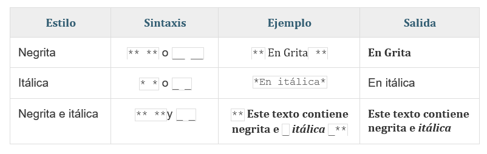

\
\

# Introducción

Para obtener más información sobre los sitios web de R Markdown simples, lea la documentación en https://bookdown.org/yihui/rmarkdown/rmarkdown-site.html.

Revise cada una de las secciones para que aprenda de algunos tips clásicos

\
\
\

## Temas para modificación de plantillas
Los temas puedes cambiarlo únicamente desde el archivo "_site.yml" y puedes utilizar: 
"default", "cerulean", "journal", "flatly", "darkly", "readable", "spacelab", "united", "cosmo", "lumen", "paper", "sandstone", "simplex", or "yeti".


Para crear pestañas también debes modificar el archivo "_site.yml"

Puedes escribir los siguientes comandos


```markdown
   right:
     - text: "Home"
       href: index.html
     - text: "About"
       href: about.html
```

Es importante que dejes la **indentación** (espacios brindados) como se muestra en el ejemplo.

\
\
\

## Tipos de fuentes y estilos de letras.  

Para obtener diferetes tipos de fuentes, utiliza el simbolo **#** y un espacio posterior al incio de cada título o subtitulo que requieras utilizar.

# Encabezado 1
## Encabezado 2
### Encabezado 3


```markdown
# Encabezados más grandes
## El segundo encabezado más grande
### El encabezado más pequeño
```


<div align="center">

\
\
\


## Estilo de Texto.
</div>

<p align="center"></p>

\
\
\


## Color de texto 

Para crear color en texto se debe generar un "spam (lapzo)" previo y cerrarlo de la misma manera

Rosas son <span style="color:red">rojas</span>, y las violetas son <span style="color:blue">azules</span>.


```markdown
Rosas son <span style="color:red">rojas</span>, y las violetas son <span style="color:blue">azules</span>.

```

\
\
\

## Justificado


<p align="justify">
Cuando justifica texto, se agrega espacio entre palabras para que los bordes de cada línea se alineen con ambos márgenes. La última línea del párrafo se alinea a la izquierda.

```markdown
<p align="justify">
Cuando justifica texto, se agrega espacio entre palabras para que los bordes de cada línea se alineen con ambos márgenes. La última línea del párrafo se alinea a la izquierda
</p>
```

Puede utilizar 

```markdown
<p align="justify">
<p align="center">
<p align="left">
<p align="right">
```

\
\
\

y finalice el justificado al finalizar de su oración o párrafo con:

```markdown
</p>
```

otra **forma** de aplicar de forma sencilla es utilizar 

\
\
\

<center>Estilo de Texto centrado</center>

```markdown
<center>Estilo de Texto</center>
```
\
\
\

## Links e hipervínculos

```markdown
[página](https://osoramirez.weebly.com/)
<https://osoramirez.weebly.com> 
```
\
\
\

## Mayor espacio entre párrafos

Utilice:

```markdown
\
\
\
\
```

**No olvide solicitar su espacio ilimitado con su cuenta de correo institucional** al siguiente [link](https://education.github.com/discount_requests/new)

